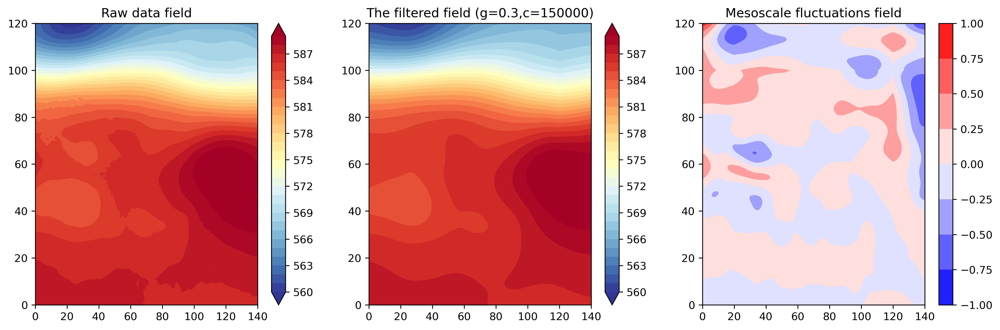

# pybarnes
## Method
Barnes is a commonly used spatial filtering method that mainly uses two constants g and c to calculate Gaussian weights, and performs spatial interpolation for each grid point, thus becoming a low-pass filter that filters out high-frequency fluctuations. When using two different schemes of constant g and c schemes, both retain low-frequency fluctuations of different scales. The difference between the filtering results of the two methods can result in mesoscale fluctuations.

Reference:
《<a href="https://doi.org/10.1175/1520-0493(1980)108%3C1108:AOTFSM%3E2.0.CO;2">An Objective Technique for Separating Macroscale and Mesoscale Features in Meteorological Data</a>》
   

## Installation
After installing metpy, use pip to install:
```
pip install pybarnes
```

## Get started
### Prepare the raw data
```python
import numpy as np
import xarray as xr
import matplotlib.pyplot as plt
from matplotlib.colors import TwoSlopeNorm
from pybarnes import BarnesFilter

ds = xr.open_dataset("./era5uvz500.nc").sortby("latitude")
ds = ds.sel(longitude=slice(70, 140), latitude=slice(0, 60))
ds = ds.isel(longitude=slice(None, None, 2), latitude=slice(None, None, 2))
z1 = ds.z[0]/98
```

### Barnes fileter
```python
f = BarnesFilter(z1)
ds = f.lowpass(g=0.3, c=150000)
z2 = ds.z
ds = f.bandpass(g1=0.3, c1=30000, g2=0.3, c2=150000)
z3 = ds.z
```

### Show the data
```python
plt.figure(figsize=(16, 4.8))
plt.subplot(131)
plt.colorbar(plt.contourf(z1, levels=np.arange(560, 590), extend="both", cmap=plt.cm.RdYlBu_r))
plt.title("Raw data field")
plt.subplot(132)
plt.title("The filtered field (g=0.3,c=150000)")
plt.colorbar(plt.contourf(z2, levels=np.arange(560, 590), extend="both", cmap=plt.cm.RdYlBu_r))
plt.subplot(133)
plt.title("Mesoscale fluctuations field")
plt.colorbar(plt.contourf(z3, cmap=plt.cm.bwr, norm=TwoSlopeNorm(0)))
plt.show()
```



## Contract authors
e-mail：1439731362@qq.com
